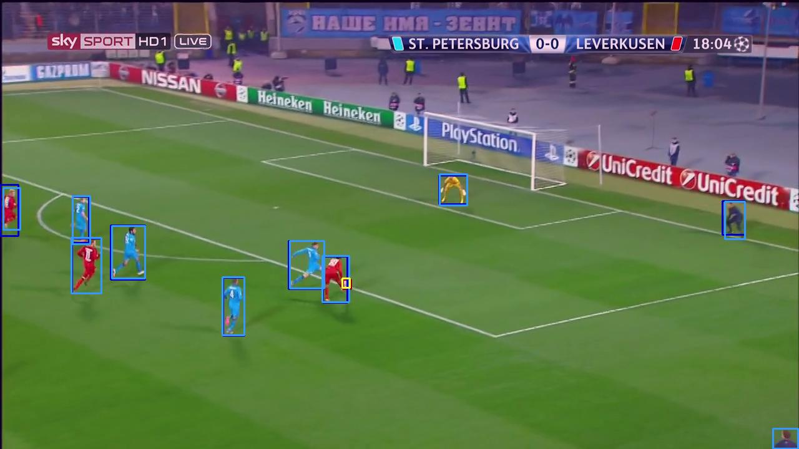
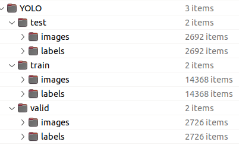
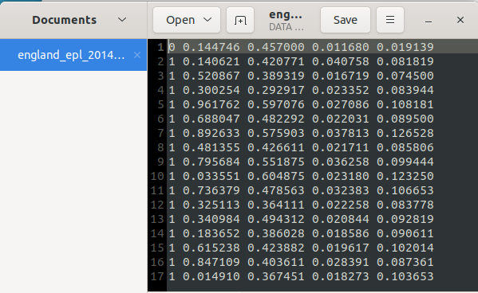
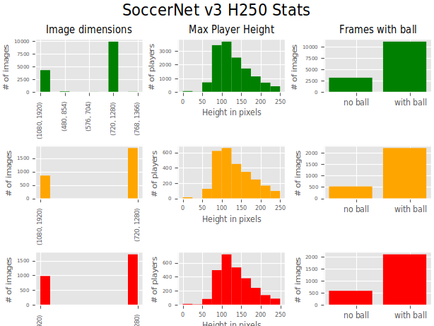

## *SoccerNet v3 H250* (YOLO annotations for Ball & Player Detection)
**Setting a Baseline for long-shot real-time Player and Ball detection in Soccer Videos](https://easyconferences.eu/iisa2023/)** IISA 2023 Volos, Greece. 

Created by [Kostas Moutselos](mailto:kmouts@unipi.gr),
and Ilias Maglogiannis
at <a href="https://cbml.ds.unipi.gr"> CBML </a>

### Abstract
Players and ball detection are among the first required steps on a football analytics platform.
Until recently, the existing open datasets on which the evaluations of most models were based,
were not sufficient. We point out their weaknesses, and with the advent of SoccerNet v3, we
propose and deliver to the community an edited part of it, in YOLO normalized annotation format,
for the reliable evaluation of related models [**https://doi.org/10.5281/zenodo.7808511**](https://doi.org/10.5281/zenodo.7808511). 
The code of the methods and metrics are also available so that they can be used as a
benchmark in future comparisons. [https://github.com/kmouts/FootAndBall].
The recent YOLO8n model proves better than FootAndBall in long-shot real-time detection of the ball and players on football fields.

### Directory Structure

### YOLO Normalized Annotations

### Annotations
Only two classes are included in the YOLO annotations: Ball (0), and Person (1).

### Dataset Statistics
Daset statistics regarding the train (green), validation (orange) and test (red) parts.

### Citation
Please, if you use the SoccerNet v3 H250 Dataset, consider citing:

    @conference{IISA 2023 14th International Conference on Information,Intelligence, Systems and Applications,
    author={Konstantinos Moutselos and Ilias Maglogiannis},
    title={Setting a Baseline for long-shot real-time Player and Ball detection in Soccer Videos},
    booktitle={},
    year={2023},
    pages={-},
    publisher={},
    organization={},
    doi={},
    isbn={},
    }

### License
Our code is released under the MIT License (see LICENSE file for details).
We have added the License from SoccerNet v3.

